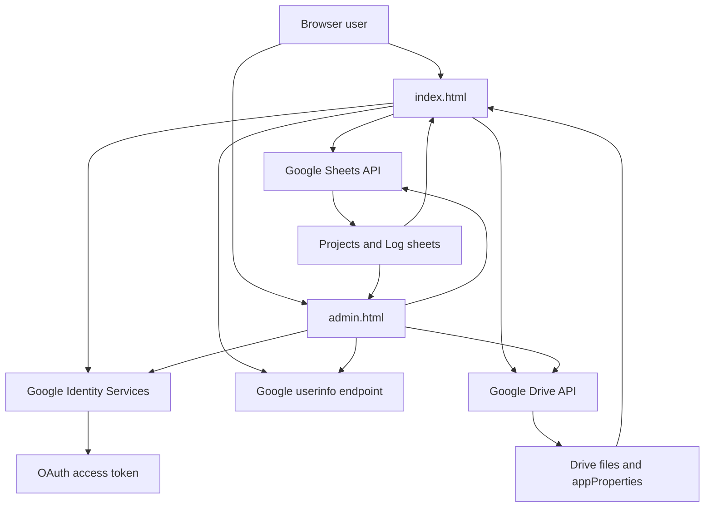

# Architecture

This document describes the current implementation of `OvernightYoutubeVidioUploader` as it exists in source today. It is written for maintainers and AI agents who need to understand the codebase quickly and safely.

## System overview

- The app is a static site deployed to GitHub Pages.
- Both pages run entirely in the browser. There is no custom backend.
- Browser code authenticates with Google Identity Services and uses the returned OAuth token to call:
  - Google Drive API
  - Google Sheets API
  - Google OAuth userinfo endpoint
- The app has two runtime entrypoints:
  - `index.html`: uploader and personal history page
  - `admin.html`: admin-only operations page
- Page behavior is implemented in external ES modules under `js/pages/`.
- Shared utilities and contracts live under `js/shared/`.
- Google API wrappers live under `js/services/`.
- Shared configuration lives in `app.js`.
- Shared styles live in `style.css`.

## End-to-end flow



## Source of truth by file

| File | Responsibility |
| --- | --- |
| `app.js` | Shared config object (`CONFIG`) for OAuth, Sheet names/IDs, Drive root folder, admin email, scopes, upload chunk size, and description templates |
| `index.html` | Main uploader page markup plus module bootstrap for `js/pages/index-page.js` |
| `admin.html` | Admin page markup plus module bootstrap for `js/pages/admin-page.js` |
| `js/pages/index-page.js` | Main user flow: sign-in screen, uploader UI, video-type loading, per-file/common descriptions, in-memory upload queue, Drive resumable upload, Log append, personal history, inline history editing |
| `js/pages/admin-page.js` | Admin-only flow: admin auth gate, permission grants, local allowed-email editor, project CRUD-lite, recent file search, Drive delete + Log row delete |
| `js/shared/*.js` | Shared contracts, auth helpers, formatting helpers, filename helpers, and browser storage keys |
| `js/services/*.js` | Low-level Google Drive and Google Sheets API wrappers used by both pages |
| `style.css` | Shared visual system for both pages |
| `.github/workflows/deploy.yml` | Deploys the repo root to GitHub Pages on `main` pushes or manual dispatch |

## External dependencies

| Dependency | Where used | Purpose |
| --- | --- | --- |
| Google Identity Services script | `index.html`, `admin.html` | OAuth token acquisition |
| Google Drive API | both pages | Upload files, search files, patch metadata, create folders, manage permissions, delete files |
| Google Sheets API | both pages | Load projects, append log rows, update project flags, update history metadata, delete log rows |
| OAuth userinfo endpoint | both pages | Resolve signed-in email address |
| First-party cookies | both pages | 7-day remember-sign-in preference and display-only cached email hint |
| `localStorage` | both pages | Last selected project and browser-local allowed-email display list |

## Configuration contract (`app.js`)

`app.js` exports a single `CONFIG` object. Both pages import it with `type="module"`.

| Key | Meaning |
| --- | --- |
| `CLIENT_ID` | Google OAuth client ID |
| `SPREADSHEET_ID` | Spreadsheet used for both `Projects` and `Log` sheets |
| `PROJECTS_SHEET` | Sheet title for project metadata |
| `LOG_SHEET` | Sheet title for upload log/history metadata |
| `ROOT_FOLDER_ID` | Parent Drive folder that contains per-project folders |
| `ADMIN_EMAIL` | Only this email can fully use `admin.html`; `index.html` uses it only to show/hide the admin link |
| `ALLOWED_EMAILS` | Default list shown on the login screen if browser-local override is absent |
| `CHUNK_SIZE` | Chunk size for Drive resumable uploads; current code uses 8 MiB |
| `SCOPES` | OAuth scopes used by both pages |
| `APP_SCHEMA` | Drive `appProperties.schema` value used to identify files created by this app |
| `TEMPLATES` | Description template list for the uploader page |

## Data contracts

### `Projects` sheet (`A:H`)

The uploader and admin page both read `Projects!A2:H`.

| Column | Logical field | Meaning |
| --- | --- | --- |
| `A` | `projectNo` | Human-facing numeric project number |
| `B` | `projectId` | Slug-like stable project identifier used in filenames and Drive metadata |
| `C` | `projectName` | Display name |
| `D` | `folderId` | Drive folder ID for that project's uploads |
| `E` | `nextSeq` | Stored next sequence value, but not the authoritative source for current uploads |
| `F` | `isActive` | `TRUE`/`FALSE`; only active rows appear in the uploader page |
| `G` | `createdAt` | ISO timestamp created by admin page |
| `H` | `createdBy` | Admin email that created the project |

### `Log` sheet (`A:L`)

The main page appends rows to `Log!A1` and later reads `Log!A2:L`.

| Column | Logical field | Meaning |
| --- | --- | --- |
| `A` | `uploadedAt` | ISO timestamp generated in browser at append time |
| `B` | `projectId` | Project slug |
| `C` | `uploaderEmail` | Signed-in user email |
| `D` | `seq` | Sequence number used in filename |
| `E` | `fileName` | Final Drive filename written by the app |
| `F` | `sizeBytes` | Raw file size in bytes |
| `G` | `description` | Uploader description text |
| `H` | `driveFileId` | Drive file ID |
| `I` | `driveLink` | Web view link |
| `J` | `templateId` | Selected description template ID |
| `K` | `appVersion` | Hardcoded string currently written as `v1.0` |
| `L` | `videoType` | User-selected or typed video type |

### Drive `appProperties`

Uploaded files are tagged with Drive `appProperties`. These are used later by search/history/admin flows.

| Key | Meaning |
| --- | --- |
| `schema` | Must equal `CONFIG.APP_SCHEMA` for app-owned file discovery |
| `projectId` | Project slug |
| `projectNo` | Project number as string |
| `seq` | Sequence number as string |
| `uploaderEmail` | Signed-in uploader email |
| `recordingDate` | Date used in filename, stored as `YYYYMMDD` |
| `videoType` | Selected/typed video type |

### Filename format

The current canonical format is:

```text
projectId_YYYYMMDD_####_label.ext
```

Details:

- `projectId` comes from `Projects.B`
- `YYYYMMDD` is the selected recording date, defaulting to the current Tokyo date
- `####` is a zero-padded sequence number
- `label` is required and sanitized by `sanitizeLabel()`
- `ext` is derived from the original filename and stripped to lowercase alphanumeric plus dot

Helper functions that depend on this format:

- `sanitizeLabel()` in `js/shared/file-name.js`
- `extractYyyymmddFromFileName()` in `js/shared/file-name.js`
- `extractLabelFromFileName()` in `js/shared/file-name.js`
- `extractExtFromFileName()` in `js/shared/file-name.js`

### Browser persistence

#### Cookies

These cookies are first-party browser cookies with `Path=/`, `SameSite=Lax`, `Secure`, and `Max-Age=604800`.

| Key | Used by | Meaning |
| --- | --- | --- |
| `devlog_remember_signin` | both pages | If the value is `"1"`, the page attempts silent sign-in on load |
| `devlog_last_email` | both pages | Display-only cached email shown on signed-out screens as a hint |

Important rules:

- No cookie stores `access_token`, refresh tokens, or any reusable Google API credential.
- Silent sign-in still depends on the browser's Google session state and `requestAccessToken({ prompt: "" })`.
- Explicit logout clears both cookies.
- The old `localStorage.devlog_remember_signin` value is migrated into the remember cookie once, then the cookie becomes authoritative.

#### `localStorage`

| Key | Used by | Meaning |
| --- | --- | --- |
| `devlog_last_project` | `index.html` | Restores last selected project in the uploader page |
| `devlog_allowed_emails` | both pages | Browser-local list used for login-screen display; not a server-side or shared permission source |

## Main page behavior (`index.html` + `js/pages/index-page.js`)

### Boot and auth flow

Primary helpers:

- `setLoggedOut()`
- `setLoggedIn()`
- `fetchMyEmail()`
- `isPermissionDeniedError()`
- `buildAllowedList()`
- `tokenClient` callback setup

Runtime behavior:

1. On load, the page clears UI state with `setLoggedOut()`.
2. The login screen shows an allowed-account list.
3. That list is built from `localStorage.devlog_allowed_emails` if present, otherwise from `CONFIG.ALLOWED_EMAILS`.
4. If `devlog_remember_signin=1` is present in the cookie jar, the page attempts silent auth with `requestAccessToken({ prompt: "" })`.
5. On successful auth:
   - resolves the email via the Google userinfo endpoint
   - caches that email into the display-only `devlog_last_email` cookie for 7 days
   - hides the login screen
   - enables uploader controls
   - loads templates, video types, projects, and recent history
   - shows the admin link only if `myEmail === CONFIG.ADMIN_EMAIL`
6. If silent sign-in fails, the page stays signed out and may still show the cached-email hint until cookie expiry or explicit logout.
7. If Google API access later fails with 403, the page shows a post-login "No access" state.
8. On explicit logout, the page clears both auth-related cookies.

Important note:

- The login-screen allowed email list is informational UI only. Real access depends on Google Drive/Sheets permissions, not that list.
- The cached email hint is informational UI only. It does not mean the user is authenticated.

### Project loading

Primary helpers:

- `loadProjects()`
- `getSelectedProjectMeta()`

Behavior:

- Reads `Projects!A2:H`
- Keeps only rows with:
  - non-empty `projectId`
  - non-empty `projectName`
  - non-empty `folderId`
  - `isActive === TRUE`
- Sorts active projects by numeric `projectNo`
- Restores the last selected project from `devlog_last_project`
- Reuses the same project list to populate the history filter dropdown

### Video type loading

Primary helpers:

- `loadVideoTypesFromLog()`
- `renderVideoTypeSelect()`
- `syncVideoTypeInputFromSelect()`

Behavior:

- Reads `Log!L2:L`
- Builds a unique, case-insensitive list of non-empty video types
- Sorts it alphabetically
- Keeps a free-text input so the user can still type custom values
- If no values exist yet, manual entry is required

### Description modes

Primary helpers:

- `initTemplates()`
- `updateDescModeUI()`
- `buildPerFileEditors()`
- `getPerFileDescriptions()`

Behavior:

- Two modes exist:
  - common description for all selected files
  - per-file description textareas
- Template selection only populates the common description textarea
- Per-file mode requires each selected file to have a non-empty description before upload starts

### File selection and drag/drop

Primary helpers:

- drag/drop listeners on `dropZone`
- `getSelectedMultiFileQueueMode()`
- `syncSelectedFilesUI()`
- `attemptAutoQueue()`
- `enqueueUploadDraft()`
- `updateSelectedSize()`

Behavior:

- Only video MIME types are accepted during drag/drop
- Both file picker multi-select and drag/drop multi-file selection are supported
- File selection order is preserved and upload order follows that same order
- A multi-file queue mode toggle exists with:
  - default `batch as one queue item`
  - optional `split into one queue item per file`
- The toggle only changes behavior when more than one file is selected
- Selecting files rebuilds per-file description editors
- If all required upload fields are already valid, selecting files creates a queue item immediately
- If required fields are still missing, the page keeps a pending auto-queue state and queues the files as soon as the missing fields are filled
- Queueing clears the selected files and short label so the user can prepare the next job while the current one uploads
- Recording date defaults to the current Tokyo date only when the field is blank at file-selection time

### Upload pipeline

Primary helpers:

- `buildUploadDraft()`
- `createQueueJobsFromDraft()`
- `processQueueJob()`
- `processUploadQueue()`
- `getNextSeqSmallestAvailable()`
- `drive.startResumableUpload()`
- `uploadInChunks()`
- `appendLogRow()`

Actual upload sequence:

1. Validate:
   - at least one file selected
   - project selected
   - recording date is either blank or parseable
   - description present
   - video type present
   - short label present
2. Snapshot the current form into one or more in-memory queue items that store:
   - project metadata
   - recording date
   - short label
   - video type
   - template ID
   - selected file objects
   - resolved per-file or common descriptions
3. Queue-item creation depends on the selected multi-file mode:
   - `batch`: one queue item can hold multiple files
   - `split`: each selected file becomes its own queue item
4. A single queue runner processes queued items one at a time.
5. For each selected file in the queue item, in order:
   - compute the next sequence using `getNextSeqSmallestAvailable(projectId)`
   - derive the file extension from the original name
   - construct the final filename
   - create a Drive resumable upload session
   - upload the file in chunks using `CONFIG.CHUNK_SIZE`
   - append a log row to `Log`
6. After each queue item finishes or partially finishes:
   - highlight newly uploaded rows in history if they appear in the reloaded table
   - keep later queued items moving even if one item failed

Progress model:

- Progress is overall across the currently uploading queue item, not the entire queue.
- Speed display uses an exponential moving average.
- The main form stays editable while a queue item is uploading.
- `uploadInProgress` and `queueRunnerActive` prevent overlapping queue runners.

### Upload queue

Primary helpers:

- `renderUploadQueue()`
- `clearDraftSelectionUI()`
- delegated `uploadQueue` click handler

Behavior:

- Queue items exist only in browser memory.
- Statuses are:
  - `queued`
  - `uploading`
  - `completed`
  - `failed`
- Multi-file behavior can be either:
  - one batch queue item containing multiple files
  - one queue item per file in the original selection order
- Single-file selections always become one queue item regardless of the selected mode.
- `queued` items can be removed before they start.
- `completed` and `failed` items can be dismissed from the queue UI.
- `failed` items are not retried automatically, because a partial batch may already have uploaded some files.
- Logging out while there is queued or active work is blocked by disabling the sign-out button.

### Sequence generation

Primary helper:

- `getNextSeqSmallestAvailable(projectId, limitRows = 5000)`

Behavior:

- Reads `Log!A2:L`
- Looks at up to the last 5000 rows
- Collects existing `seq` values for the target project from column `D`
- Returns the smallest positive integer not already used

Operational consequence:

- Sequence gaps caused by deletions can be reused later.
- The authoritative sequence source for uploads is currently the `Log` scan, not `Projects.E`.

### Personal history view

Primary helpers:

- `loadMyHistory()`
- `loadMyLogMap()`

Behavior:

- Searches Drive for files where:
  - `trashed=false`
  - `appProperties.schema === CONFIG.APP_SCHEMA`
  - `appProperties.uploaderEmail === myEmail`
- Optional project filter adds a `projectId` appProperties predicate
- Results are ordered by `createdTime desc`
- Description and editable metadata are enriched from `Log`, not solely from Drive

History table columns:

- upload date in Tokyo time
- project ID
- sequence
- file link
- size
- video type
- description from Sheets
- edit action

### Inline history editing

Primary helpers:

- delegated click handler on `history`
- `updateDriveFileMeta()`
- `updateLogRowAfterInlineEdit()`

Editable fields:

- project
- recording date
- short label
- video type
- description

What gets updated:

- Drive file:
  - `name`
  - parent folder when project changes
  - `appProperties.projectId`
  - `appProperties.projectNo`
  - `appProperties.seq`
  - `appProperties.recordingDate`
  - `appProperties.videoType`
- Sheets `Log` row:
  - column `B` (`projectId`)
  - column `D` (`seq`)
  - column `E` (`fileName`)
  - column `G` (`description`)
  - column `L` (`videoType`)

What does not get updated during inline edit:

- Drive file description text
- file size

This means the user-visible description in history comes from Sheets and can diverge from the Drive file description after edits.

When the project is changed during inline edit:

- the file is moved to the target project's Drive folder
- a new sequence is allocated for the destination project
- the filename is regenerated with the destination `projectId` and new sequence

## Admin page behavior (`admin.html` + `js/pages/admin-page.js`)

### Admin gate

Primary helpers:

- `fetchMyEmail()`
- `showBlocked()`
- `showAdmin()`
- `tokenClient` callback setup

Behavior:

- Both sign-in and silent sign-in are supported.
- Remember preference and cached-email hint come from cookies shared with the main page.
- After login, the page resolves the user email.
- Full admin UI is shown only if the email matches `CONFIG.ADMIN_EMAIL`.
- Non-admin users can sign in but are shown a blocked message instead of admin tools.

### Access management

Primary helpers:

- `driveCreateUserPermission()`
- `driveListUserPermissions()`
- `grantUserAccessToUploader()`
- `loadAccessList()`
- `renderAllowedEmailsEditor()`

Behavior:

- Admin can grant writer access to:
  - the spreadsheet
  - the root Drive folder
  - all existing project folders
- Access list display merges permissions from the spreadsheet and root folder by email.
- A browser-local allowed-email editor is also shown for login-screen display text.

Important distinction:

- Access grants are real Google permissions.
- The allowed-email editor only updates `localStorage.devlog_allowed_emails` in that browser.
- Editing that list does not grant or revoke actual Drive/Sheets access.

### Project management

Primary helpers:

- `loadProjects()`
- `normalizeProjectId()`
- `createDriveFolder()`
- `addProject()`

Behavior:

- Admin can add a project by entering:
  - `projectId`
  - `projectName`
- `projectId` is normalized to lowercase snake-like text
- Admin page:
  - reads existing rows from `Projects`
  - finds the next numeric project number
  - creates a new Drive folder under `CONFIG.ROOT_FOLDER_ID`
  - appends a new row to `Projects`
- Existing projects can be toggled between active and archived by updating `Projects.F`

### File administration and deletion

Primary helpers:

- `driveSearchRecent()`
- `driveDeleteFile()`
- `findLogRowNumbersByFileId()`
- `deleteLogRowsByFileId()`
- `loadFiles()`

Behavior:

- Admin file search lists recent Drive files created by this app
- Optional filter by `projectId`
- Limit is configurable in the UI
- Deletion flow:
  1. delete Drive file
  2. delete matching row(s) from the `Log` sheet
  3. reload file table

Deletion is available from:

- per-row buttons in the recent files table
- a manual "Delete by File ID" action

## Shared implementation notes

### Deployment

`.github/workflows/deploy.yml`:

- runs on pushes to `main`
- can also run manually with `workflow_dispatch`
- uploads the repo root as the GitHub Pages artifact
- has no build step

### Styling

`style.css` is a shared stylesheet for both pages. It defines:

- theme variables
- shared layout primitives (`container`, `grid`, `card`, `row`)
- responsive shell utilities (`containerWide`, `gridWide`, `gridHistoryPriority`, `gridSingleWide`)
- form controls
- buttons
- table styling
- login screen styling
- uploader-specific UI blocks

There is no CSS module or component-level scoping. Both HTML pages rely on the same global class names and variables.

Desktop layout priority:

- `index.html` uses a history-first two-column grid, so `My upload history` becomes wider than `Upload` on medium and large screens.
- On extra-wide desktops, the history column is intentionally favored much more aggressively than the upload column.
- `admin.html` stays single-column, but now inherits the wider fluid shell so list-heavy cards are less constrained by the old fixed-width container.

## Known quirks and maintenance traps

These are important. Do not "fix" them accidentally without documenting the behavioral change.

1. The login-screen allowed-email list is not a real access-control system.
   - It is either `CONFIG.ALLOWED_EMAILS` or browser-local `devlog_allowed_emails`.
   - Real access comes from Google permissions on the spreadsheet and Drive folders.

2. `Projects.E` (`nextSeq`) is not the active sequence allocator.
   - Upload currently uses `getNextSeqSmallestAvailable()` based on `Log`.
   - `Projects.E` remains operational metadata, not the upload allocator.

3. Sequence scanning and history enrichment use bounded log reads.
   - `getNextSeqSmallestAvailable()` scans only the last 5000 log rows.
   - `loadMyLogMap()` scans only the last 800 log rows.
   - Very old rows can be missed by those helpers.

4. History descriptions come from Sheets, not exclusively from Drive.
   - Upload writes description to both Drive metadata and the Sheets log.
   - Inline edit updates the Sheets description but does not patch the Drive description.

5. Deletion is not transactional.
   - Admin delete removes the Drive file first, then removes matching `Log` rows.
   - If the second step fails, Drive and Sheets can become inconsistent.

6. Upload queue work is in-memory, sequential, and partially persistent.
   - Refreshing the page clears queued items that have not started yet.
   - If a later file in a queue item fails, earlier files and earlier log rows remain.
   - There is no rollback or cleanup step.

7. The admin access list and project-folder permissions are not the same view.
   - `loadAccessList()` shows spreadsheet and root-folder permissions only.
   - `grantUserAccessToUploader()` also attempts to grant all existing project folders.

8. The browser-local allowed-email editor is local only.
   - It does not persist to Drive, Sheets, or the repository.
   - Other browsers will not automatically see that edited list.

9. Remembered sign-in is preference storage, not token storage.
   - The app only remembers whether it should try silent sign-in and which email to show as a signed-out hint.
   - Actual re-authentication still depends on the Google browser session.

## Quick code navigation

If you need to change behavior, start with these functions:

| Concern | Function(s) |
| --- | --- |
| Main page login/bootstrap | `setLoggedOut`, `setLoggedIn`, `fetchMyEmail`, `tokenClient.callback` in `js/pages/index-page.js` |
| Project dropdown | `loadProjects` in `js/pages/index-page.js` |
| Video type loading | `loadVideoTypesFromLog` in `js/pages/index-page.js` |
| Upload readiness and auto-queue | `buildUploadDraft`, `getSelectedMultiFileQueueMode`, `syncSelectedFilesUI`, `attemptAutoQueue`, `enqueueUploadDraft` in `js/pages/index-page.js` |
| Upload queue rendering and actions | `renderUploadQueue`, delegated `uploadQueue` click handler in `js/pages/index-page.js` |
| Upload execution | `createQueueJobsFromDraft`, `processQueueJob`, `processUploadQueue`, `startResumableUpload`, `uploadInChunks`, `appendLogRow` across `js/pages/index-page.js` and `js/services/drive.js` |
| History edit | delegated `history` click handler, `updateDriveFileMeta`, `updateLogRowAfterInlineEdit` in `js/pages/index-page.js` |
| Admin sign-in gate | `tokenClient.callback`, `showBlocked`, `showAdmin` in `js/pages/admin-page.js` |
| Granting access | `grantUserAccessToUploader`, `loadAccessList` in `js/pages/admin-page.js` |
| Project creation | `addProject` in `js/pages/admin-page.js` |
| Admin deletion | `loadFiles`, `deleteLogRowsByFileId` in `js/pages/admin-page.js`, `deleteFile` in `js/services/drive.js` |

## When you edit this app

Always update this document when any of the following changes:

- page entrypoints or file ownership
- shared module contracts or Google service wrappers
- auth behavior or permission model
- filename format
- `Projects` or `Log` column meanings
- Drive `appProperties`
- cookie or browser-persistence behavior
- localStorage usage
- deployment flow
- upload, history, admin, or deletion behavior

Then append a new entry to `docs/CHANGELOG.md`.

Recommended update checklist:

1. Update the relevant behavior section in this document.
2. Update any affected data-contract table.
3. Add or revise a known-quirks note if behavior changed in a subtle way.
4. Append a dated entry to `docs/CHANGELOG.md`.
5. If the repo entrypoint changed, update `README.md`.
